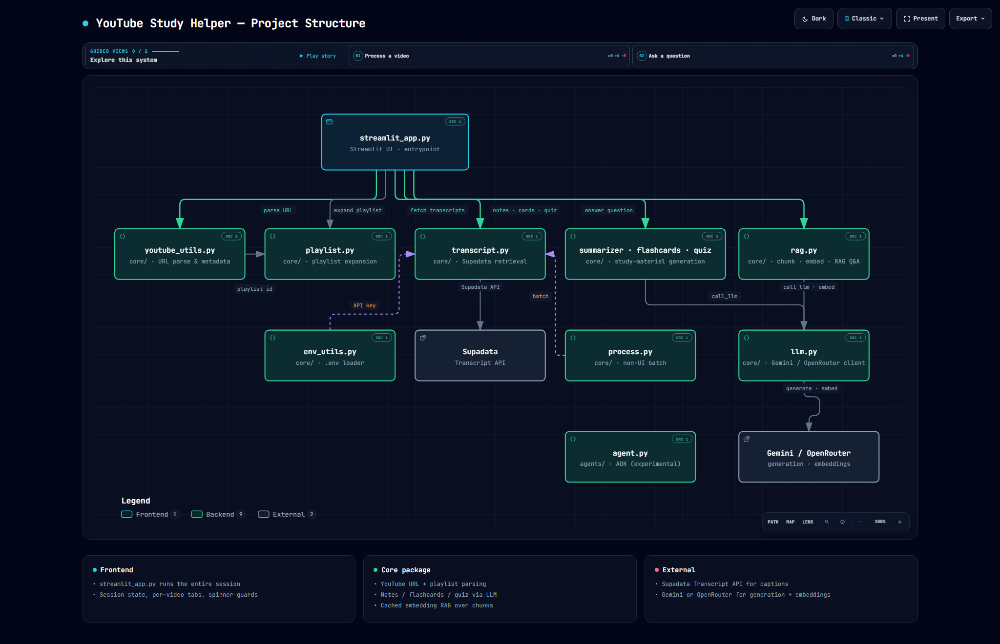
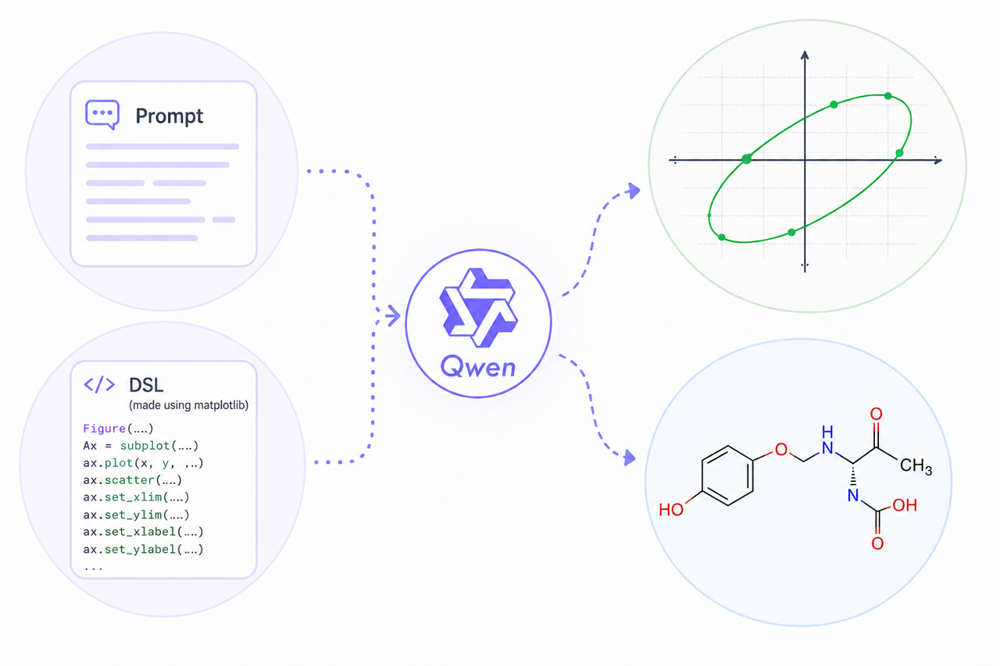
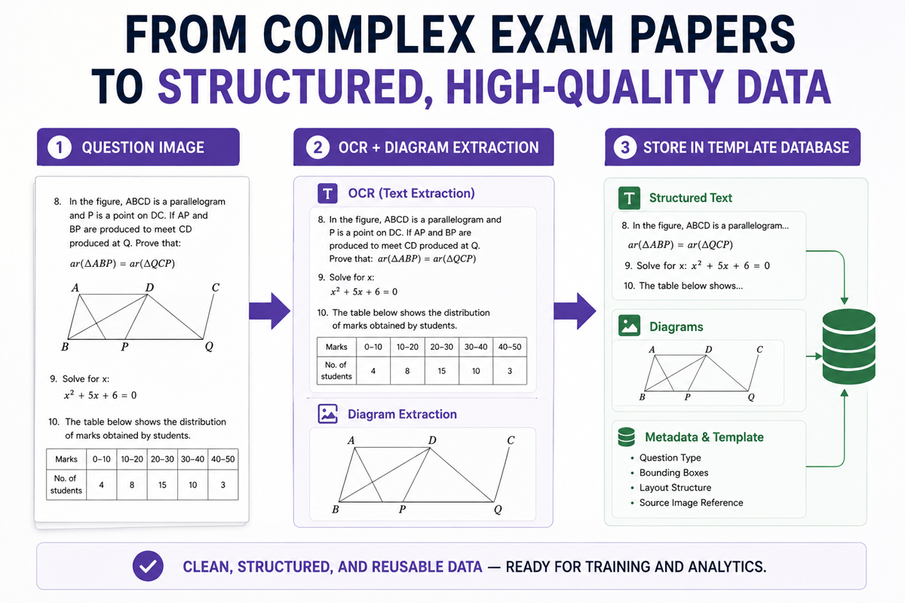

  

  
  
  
  

  <em>"I turn unreliable LLM outputs into production systems."</em> 
  <em>"AI reliability is a design problem, not a model problem."</em>

---

### Proof Points & Operational Metrics

- **96.1% mAP50 / 88.9% mAP50-95** on dense document layout and figure extraction via fine-tuned DocLayout-YOLO (YOLOv10m).
- **~95% cost reduction (to ₹0 API cost)** by replacing raw LLM coordinate guessing with an LLM-to-IR 16-tool deterministic geometry compiler on local dual RTX 3090s.
- **13,000+ students served** by campus digital platforms as Institute Web Convener at IIT Bombay.
- **3.4M+ transactions & orders analyzed** in production retail basket analytics.

---

### Featured Systems & Codebases

#### 1. [YouTube Study Helper](https://github.com/ShubhSarin/youtube-study-helper)
*Production RAG Platform on Azure Container Apps · [Live App](https://yt-helper.shubhsareen.com)*
- Converts full playlist-scale lecture series into structured chapter notes, interactive flashcards, and quizzes.
- Engineered fault-tolerant ingestion handling 5 distinct transcript failure modes with per-video isolation.
- Multi-model routing layer across OpenRouter and Gemini with a 3-stage hallucination filtering pipeline.
- **Stack:** Python, Streamlit, Azure Container Apps, Docker, ChromaDB, RAG.

  

#### 2. Programmatic SVG & 16-Tool Geometry Compiler
*LLM-to-IR Architecture · Autonise Internship (May–June 2026)*
- Decoupled semantic reasoning from coordinate emission by creating a 16-tool domain-specific language (`calculate_intersection`, `tangent_to_circle`, `compute_centroid`, etc.).
- Enforced a strict *tool-before-coordinate mandate* so the model outputs a topological constraint graph rather than pixel coordinates.
- Deterministic NumPy + Matplotlib compiler analytically solves the equations into clean vector SVGs, dropping diagram failure rates from ~60% to 0%.

  

#### 3. DocLayout-YOLO & Two-Collection Ingestion Pipeline
*High-Density Document Segmentation & OCR*
- Fine-tuned YOLOv10m on a 33k-image synthetic dataset with variable fonts, multi-column layouts, and margin shifts (96.1% mAP50 / 88.9% mAP50-95).
- Diagnosed and fixed an upstream float16 export defect that silently zeroed out Distribution Focal Loss (DFL) gradients.
- Integrated into a two-collection MongoDB staging pipeline with scope-enforced reads and interactive human review.

  

#### 4. [WIDS-2025-Agentic-AI](https://github.com/ShubhSarin/WIDS-2025-Agentic-AI)
*Multi-Agent State Machines & Tool Coordination*
- Implemented LangGraph state machines using TypedDict state, conditional router dispatching, and looping control flow.
- Built 8 Google ADK agent patterns including Sequential, Parallel, Session-persistent, and Tool-calling agents.
- **Stack:** Python, LangGraph, Google ADK, Streamlit.

#### 5. [Vision-to-text-SOC](https://github.com/ShubhSarin/Vision-to-text-SOC)
*Attention-Based Multimodal Image Captioning*
- ResNet-50 feature extractor paired with an LSTM language decoder augmented with Bahdanau additive attention.
- Generates dynamic alignment heatmaps over image regions during autoregressive caption generation.
- **Stack:** PyTorch, Torchvision, Python, Bahdanau Attention, ResNet-50.

---

### Tech Stack & Core Tools

  
  
  
  
  
  
  
  
  
  
  
  
  

| ML Systems | Engineering & Cloud | Core Stack | Engineering Mindset |
| :--- | :--- | :--- | :--- |
| LLM Systems & Pipelines | Pipeline Architecture | **Python**, **C++**, **SQL** | Systems Thinking |
| Programmatic IR (LLM $\to$ Code) | Hybrid Local/Cloud Serving | **PyTorch**, **LangGraph** | Failure Mode Analysis |
| Evaluation Methodology | Docker & Container Apps | **YOLOv10**, **ChromaDB** | Metric Design & Critique |
| Pairwise & Swiss Ranking | Vector Retrieval & RAG | **Transformers**, **LoRA** | Deterministic Boundaries |
| Document Layout & OCR | MongoDB, PostgreSQL | **Azure Container Apps** | Empirical Benchmarking |
| Multimodal Attention Models | Linux / POSIX Toolchains | **Matplotlib**, **NumPy** | First-Principles Derivation |

---

### What I'm Doing Now

- **AI/ML Team Lead @ IIT Bombay:** Leading an engineering cohort preparing for and competing in national and global AI/ML competitions, data challenges, and hackathons.

---

  

